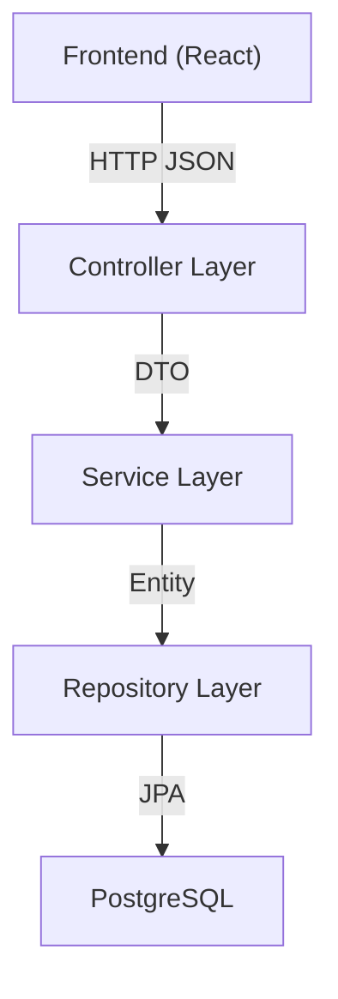

# Backend Architecture

## 1. Technology Stack

| Technology | Version | Purpose |
|------------|---------|---------|
| Kotlin | 1.9+ | Primary language |
| Spring Boot | 3.2+ | Application framework |
| Spring Web | - | REST API layer |
| Spring Data JPA | - | Data access |
| Flyway | - | Database migrations |
| PostgreSQL | 16+ | Database |
| Maven | 3.9+ | Build tool |

## 2. Project Structure

```
backend/
├── pom.xml
├── Dockerfile
├── src/
│   ├── main/
│   │   ├── kotlin/com/athletemanager/
│   │   │   ├── Application.kt
│   │   │   ├── config/
│   │   │   │   ├── CorsConfig.kt
│   │   │   │   └── JacksonConfig.kt
│   │   │   ├── common/
│   │   │   │   ├── exception/
│   │   │   │   │   ├── ResourceNotFoundException.kt
│   │   │   │   │   ├── BusinessRuleException.kt
│   │   │   │   │   └── GlobalExceptionHandler.kt
│   │   │   │   └── dto/
│   │   │   │       └── ErrorResponse.kt
│   │   │   ├── coach/
│   │   │   │   ├── CoachController.kt
│   │   │   │   ├── CoachService.kt
│   │   │   │   ├── CoachRepository.kt
│   │   │   │   ├── Coach.kt                  (entity)
│   │   │   │   └── CoachDto.kt               (request/response DTOs)
│   │   │   ├── athlete/
│   │   │   │   ├── AthleteController.kt
│   │   │   │   ├── AthleteService.kt
│   │   │   │   ├── AthleteRepository.kt
│   │   │   │   ├── Athlete.kt
│   │   │   │   └── AthleteDto.kt
│   │   │   ├── exercise/
│   │   │   │   ├── ExerciseController.kt
│   │   │   │   ├── ExerciseService.kt
│   │   │   │   ├── ExerciseRepository.kt
│   │   │   │   ├── Exercise.kt
│   │   │   │   └── ExerciseDto.kt
│   │   │   ├── workout/
│   │   │   │   ├── WorkoutController.kt
│   │   │   │   ├── WorkoutService.kt
│   │   │   │   ├── WorkoutRepository.kt
│   │   │   │   ├── Workout.kt
│   │   │   │   └── WorkoutDto.kt
│   │   │   ├── workoutexercise/
│   │   │   │   ├── WorkoutExerciseController.kt
│   │   │   │   ├── WorkoutExerciseService.kt
│   │   │   │   ├── WorkoutExerciseRepository.kt
│   │   │   │   ├── WorkoutExercise.kt
│   │   │   │   └── WorkoutExerciseDto.kt
│   │   │   └── exerciseresult/
│   │   │       ├── ExerciseResultController.kt
│   │   │       ├── ExerciseResultService.kt
│   │   │       ├── ExerciseResultRepository.kt
│   │   │       ├── ExerciseResult.kt
│   │   │       └── ExerciseResultDto.kt
│   │   └── resources/
│   │       ├── application.yml
│   │       └── db/migration/
│   │           ├── V1__init.sql
│   │           └── V2__seed.sql
│   └── test/
│       └── kotlin/com/athletemanager/
│           ├── coach/CoachServiceTest.kt
│           ├── athlete/AthleteServiceTest.kt
│           ├── exercise/ExerciseServiceTest.kt
│           └── workout/WorkoutServiceTest.kt
```

## 3. Layered Architecture



### 3.1 Controller Layer

- Annotated with `@RestController`.
- Maps HTTP requests to service method calls.
- Converts between DTOs and delegates to service.
- Handles request validation via `@Valid` / `@Validated`.
- Returns appropriate HTTP status codes.

### 3.2 Service Layer

- Annotated with `@Service`.
- Contains business logic and validation.
- Orchestrates repository calls.
- Handles transactions (`@Transactional`).
- Throws custom exceptions (`ResourceNotFoundException`, `BusinessRuleException`).

### 3.3 Repository Layer

- Extends `JpaRepository<Entity, UUID>`.
- Custom query methods via Spring Data naming conventions or `@Query`.
- Key custom queries:
  - `AthleteRepository.findByCoachId(coachId: UUID): List<Athlete>`
  - `WorkoutRepository.findByAthleteIdAndDateBetween(athleteId, start, end): List<Workout>`
  - `WorkoutRepository.findByAthlete_CoachIdAndDateBetween(coachId, start, end): List<Workout>`
  - `WorkoutRepository.findByDateBetween(start, end): List<Workout>`
  - `WorkoutExerciseRepository.findByWorkoutIdOrderByOrderIndex(workoutId): List<WorkoutExercise>`
  - `ExerciseResultRepository.findByWorkoutExerciseId(weId): ExerciseResult?`

### 3.4 Entity Layer

JPA entities map directly to database tables. Use `@Entity`, `@Table`, `@Id`, `@Column`, `@ManyToOne`, `@OneToMany`, `@OneToOne` annotations.

All entities use `UUID` as the primary key type, generated via `@GeneratedValue(strategy = GenerationType.UUID)`.

## 4. DTO Pattern

Each domain module defines request and response DTOs to decouple the API contract from the internal entity model.

**Naming convention:**

- `CreateXxxRequest` -- for POST request bodies
- `UpdateXxxRequest` -- for PUT request bodies
- `XxxResponse` -- for response bodies

**Example for Workout:**

```kotlin
data class CreateWorkoutRequest(
    @field:NotNull val athleteId: UUID,
    @field:NotBlank @field:Size(max = 255) val label: String,
    @field:NotNull val date: LocalDate,
    val notes: String? = null
)

data class UpdateWorkoutRequest(
    @field:NotNull val athleteId: UUID,
    @field:NotBlank @field:Size(max = 255) val label: String,
    @field:NotNull val date: LocalDate,
    val notes: String? = null
)

data class WorkoutSummaryResponse(
    val id: UUID,
    val athleteId: UUID,
    val athleteName: String,
    val coachId: UUID,
    val coachName: String,
    val label: String,
    val date: LocalDate,
    val notes: String?,
    val exerciseCount: Int,
    val hasResults: Boolean
)

data class WorkoutDetailResponse(
    val id: UUID,
    val athleteId: UUID,
    val athleteName: String,
    val coachId: UUID,
    val coachName: String,
    val label: String,
    val date: LocalDate,
    val notes: String?,
    val exercises: List<WorkoutExerciseResponse>
)
```

## 5. Exception Handling

A global exception handler (`@RestControllerAdvice`) catches exceptions and converts them to consistent error responses.

```kotlin
@RestControllerAdvice
class GlobalExceptionHandler {

    @ExceptionHandler(ResourceNotFoundException::class)
    fun handleNotFound(ex: ResourceNotFoundException): ResponseEntity<ErrorResponse>
    // returns 404

    @ExceptionHandler(BusinessRuleException::class)
    fun handleBusinessRule(ex: BusinessRuleException): ResponseEntity<ErrorResponse>
    // returns 409

    @ExceptionHandler(MethodArgumentNotValidException::class)
    fun handleValidation(ex: MethodArgumentNotValidException): ResponseEntity<ErrorResponse>
    // returns 400 with fieldErrors

    @ExceptionHandler(Exception::class)
    fun handleGeneral(ex: Exception): ResponseEntity<ErrorResponse>
    // returns 500
}
```

## 6. Configuration

### application.yml

```yaml
spring:
  application:
    name: athlete-manager
  jackson:
    default-property-inclusion: non_null
    serialization:
      write-dates-as-timestamps: false
  flyway:
    enabled: true
  datasource:
    url: jdbc:postgresql://${DB_HOST:localhost}:${DB_PORT:5432}/${DB_NAME:athletedb}
    username: ${DB_USER:athlete}
    password: ${DB_PASS:athlete}
  jpa:
    database-platform: org.hibernate.dialect.PostgreSQLDialect
    hibernate:
      ddl-auto: validate
```

As variáveis de ambiente (`DB_HOST`, `DB_PORT`, etc.) são passadas pelo `docker-compose.yml`. Os defaults apontam para `localhost` caso se corra fora do Docker com um PostgreSQL local.

## 7. CORS Configuration

```kotlin
@Configuration
class CorsConfig : WebMvcConfigurer {
    override fun addCorsMappings(registry: CorsRegistry) {
        registry.addMapping("/api/**")
            .allowedOrigins("http://localhost:5173", "http://localhost:3000")
            .allowedMethods("GET", "POST", "PUT", "DELETE", "OPTIONS")
            .allowedHeaders("*")
    }
}
```

## 8. Build Dependencies (pom.xml)

```xml
<?xml version="1.0" encoding="UTF-8"?>
<project xmlns="http://maven.apache.org/POM/4.0.0"
         xmlns:xsi="http://www.w3.org/2001/XMLSchema-instance"
         xsi:schemaLocation="http://maven.apache.org/POM/4.0.0
         https://maven.apache.org/xsd/maven-4.0.0.xsd">
    <modelVersion>4.0.0</modelVersion>

    <parent>
        <groupId>org.springframework.boot</groupId>
        <artifactId>spring-boot-starter-parent</artifactId>
        <version>3.2.5</version>
        <relativePath/>
    </parent>

    <groupId>com.athletemanager</groupId>
    <artifactId>athlete-manager</artifactId>
    <version>0.0.1-SNAPSHOT</version>
    <packaging>jar</packaging>

    <properties>
        <java.version>21</java.version>
        <kotlin.version>1.9.24</kotlin.version>
    </properties>

    <dependencies>
        <dependency>
            <groupId>org.springframework.boot</groupId>
            <artifactId>spring-boot-starter-web</artifactId>
        </dependency>
        <dependency>
            <groupId>org.springframework.boot</groupId>
            <artifactId>spring-boot-starter-data-jpa</artifactId>
        </dependency>
        <dependency>
            <groupId>org.springframework.boot</groupId>
            <artifactId>spring-boot-starter-validation</artifactId>
        </dependency>
        <dependency>
            <groupId>org.flywaydb</groupId>
            <artifactId>flyway-core</artifactId>
        </dependency>
        <dependency>
            <groupId>org.flywaydb</groupId>
            <artifactId>flyway-database-postgresql</artifactId>
        </dependency>
        <dependency>
            <groupId>com.fasterxml.jackson.module</groupId>
            <artifactId>jackson-module-kotlin</artifactId>
        </dependency>
        <dependency>
            <groupId>org.jetbrains.kotlin</groupId>
            <artifactId>kotlin-reflect</artifactId>
        </dependency>
        <dependency>
            <groupId>org.postgresql</groupId>
            <artifactId>postgresql</artifactId>
            <scope>runtime</scope>
        </dependency>
        <dependency>
            <groupId>org.springframework.boot</groupId>
            <artifactId>spring-boot-starter-test</artifactId>
            <scope>test</scope>
        </dependency>
    </dependencies>

    <build>
        <sourceDirectory>${project.basedir}/src/main/kotlin</sourceDirectory>
        <testSourceDirectory>${project.basedir}/src/test/kotlin</testSourceDirectory>
        <plugins>
            <plugin>
                <groupId>org.springframework.boot</groupId>
                <artifactId>spring-boot-maven-plugin</artifactId>
            </plugin>
            <plugin>
                <groupId>org.jetbrains.kotlin</groupId>
                <artifactId>kotlin-maven-plugin</artifactId>
                <configuration>
                    <args>
                        <arg>-Xjsr305=strict</arg>
                    </args>
                    <compilerPlugins>
                        <plugin>spring</plugin>
                        <plugin>jpa</plugin>
                    </compilerPlugins>
                </configuration>
                <dependencies>
                    <dependency>
                        <groupId>org.jetbrains.kotlin</groupId>
                        <artifactId>kotlin-maven-allopen</artifactId>
                        <version>${kotlin.version}</version>
                    </dependency>
                    <dependency>
                        <groupId>org.jetbrains.kotlin</groupId>
                        <artifactId>kotlin-maven-noarg</artifactId>
                        <version>${kotlin.version}</version>
                    </dependency>
                </dependencies>
            </plugin>
        </plugins>
    </build>
</project>
```

## 9. Implementation Order

Build the backend in this order to resolve dependencies correctly:

1. **Project scaffold**: Maven `pom.xml`, `Application.kt`, configuration classes. Verify with `mvn clean install`.
2. **Flyway migrations**: `V1__init.sql`, `V2__seed.sql`
3. **Common module**: Exception classes, `ErrorResponse` DTO, `GlobalExceptionHandler`
4. **Coach**: Entity -> Repository -> Service -> DTO -> Controller
5. **Exercise**: Entity -> Repository -> Service -> DTO -> Controller
6. **Athlete**: Entity -> Repository -> Service -> DTO -> Controller
7. **Workout**: Entity -> Repository -> Service -> DTO -> Controller
8. **WorkoutExercise**: Entity -> Repository -> Service -> DTO -> Controller
9. **ExerciseResult**: Entity -> Repository -> Service -> DTO -> Controller
10. **Integration testing**: Test calendar query endpoints with seed data
