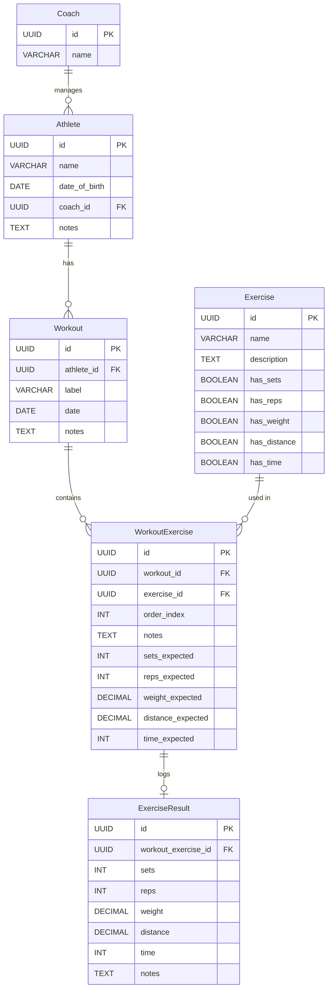

# Data Model

## 1. Entity Relationship Diagram



## 2. Entity Definitions

### 2.1 Coach

Represents a coach who manages athletes.

| Column | Type | Constraints | Description |
|--------|------|-------------|-------------|
| `id` | UUID | PK | Unique identifier |
| `name` | VARCHAR(255) | NOT NULL | Coach display name |

### 2.2 Athlete

Represents an athlete managed by a coach.

| Column | Type | Constraints | Description |
|--------|------|-------------|-------------|
| `id` | UUID | PK | Unique identifier |
| `name` | VARCHAR(255) | NOT NULL | Athlete full name |
| `date_of_birth` | DATE | NULL | Date of birth |
| `coach_id` | UUID | FK -> Coach(id), NOT NULL | The coach managing this athlete |
| `notes` | TEXT | NULL | Free-text notes about the athlete |

### 2.3 Exercise

A reusable exercise template. The boolean flags control which parameter fields are applicable when this exercise is added to a workout.

| Column | Type | Constraints | Description |
|--------|------|-------------|-------------|
| `id` | UUID | PK | Unique identifier |
| `name` | VARCHAR(255) | NOT NULL, UNIQUE | Exercise name |
| `description` | TEXT | NULL | Description or instructions |
| `has_sets` | BOOLEAN | NOT NULL, DEFAULT false | Whether "sets" parameter applies |
| `has_reps` | BOOLEAN | NOT NULL, DEFAULT false | Whether "reps" parameter applies |
| `has_weight` | BOOLEAN | NOT NULL, DEFAULT false | Whether "weight" parameter applies |
| `has_distance` | BOOLEAN | NOT NULL, DEFAULT false | Whether "distance" parameter applies |
| `has_time` | BOOLEAN | NOT NULL, DEFAULT false | Whether "time" parameter applies |

### 2.4 Workout

A single training session for one athlete on one date.

| Column | Type | Constraints | Description |
|--------|------|-------------|-------------|
| `id` | UUID | PK | Unique identifier |
| `athlete_id` | UUID | FK -> Athlete(id), NOT NULL | The athlete this workout is for |
| `label` | VARCHAR(255) | NOT NULL | Workout name (e.g., "Upper Body Strength") |
| `date` | DATE | NOT NULL | Scheduled date |
| `notes` | TEXT | NULL | General notes about the workout |

**Index:** `(athlete_id, date)` -- for calendar queries.

### 2.5 WorkoutExercise

An exercise instance within a workout, with planned/expected values.

| Column | Type | Constraints | Description |
|--------|------|-------------|-------------|
| `id` | UUID | PK | Unique identifier |
| `workout_id` | UUID | FK -> Workout(id), NOT NULL | Parent workout |
| `exercise_id` | UUID | FK -> Exercise(id), NOT NULL | The exercise template |
| `order_index` | INT | NOT NULL | Position in the workout (0-based) |
| `notes` | TEXT | NULL | Instance-specific notes |
| `sets_expected` | INT | NULL | Planned number of sets |
| `reps_expected` | INT | NULL | Planned reps per set |
| `weight_expected` | DECIMAL(10,2) | NULL | Planned weight in kg |
| `distance_expected` | DECIMAL(10,2) | NULL | Planned distance in meters |
| `time_expected` | INT | NULL | Planned time in seconds |

**Constraint:** `UNIQUE(workout_id, order_index)` -- no duplicate ordering.

Only the expected fields that correspond to the exercise's enabled parameters should be populated (enforced at the application level, not DB level).

### 2.6 ExerciseResult

Actual results logged by the coach after/during a session.

| Column | Type | Constraints | Description |
|--------|------|-------------|-------------|
| `id` | UUID | PK | Unique identifier |
| `workout_exercise_id` | UUID | FK -> WorkoutExercise(id), NOT NULL, UNIQUE | One result per workout exercise |
| `sets` | INT | NULL | Actual sets completed |
| `reps` | INT | NULL | Actual reps completed |
| `weight` | DECIMAL(10,2) | NULL | Actual weight used in kg |
| `distance` | DECIMAL(10,2) | NULL | Actual distance in meters |
| `time` | INT | NULL | Actual time in seconds |
| `notes` | TEXT | NULL | Notes about actual performance |

## 3. Relationships Summary

- **Coach 1 -> N Athlete**: A coach manages many athletes. Deleting a coach cascades to their athletes.
- **Athlete 1 -> N Workout**: An athlete has many workouts. Deleting an athlete cascades to their workouts.
- **Workout 1 -> N WorkoutExercise**: A workout contains many exercises. Deleting a workout cascades to its workout exercises.
- **Exercise 1 -> N WorkoutExercise**: An exercise template can be used in many workouts. Deleting an exercise is only allowed if it is not used in any workout (application-level check), or restricted via FK.
- **WorkoutExercise 1 -> 0..1 ExerciseResult**: A workout exercise may optionally have one result. Deleting a workout exercise cascades to its result.

## 4. Flyway Migration: V1__init.sql

```sql
CREATE TABLE coach (
    id UUID PRIMARY KEY,
    name VARCHAR(255) NOT NULL
);

CREATE TABLE athlete (
    id UUID PRIMARY KEY,
    name VARCHAR(255) NOT NULL,
    date_of_birth DATE,
    coach_id UUID NOT NULL,
    notes TEXT,
    CONSTRAINT fk_athlete_coach FOREIGN KEY (coach_id) REFERENCES coach(id) ON DELETE CASCADE
);

CREATE INDEX idx_athlete_coach_id ON athlete(coach_id);

CREATE TABLE exercise (
    id UUID PRIMARY KEY,
    name VARCHAR(255) NOT NULL UNIQUE,
    description TEXT,
    has_sets BOOLEAN NOT NULL DEFAULT false,
    has_reps BOOLEAN NOT NULL DEFAULT false,
    has_weight BOOLEAN NOT NULL DEFAULT false,
    has_distance BOOLEAN NOT NULL DEFAULT false,
    has_time BOOLEAN NOT NULL DEFAULT false
);

CREATE TABLE workout (
    id UUID PRIMARY KEY,
    athlete_id UUID NOT NULL,
    label VARCHAR(255) NOT NULL,
    date DATE NOT NULL,
    notes TEXT,
    CONSTRAINT fk_workout_athlete FOREIGN KEY (athlete_id) REFERENCES athlete(id) ON DELETE CASCADE
);

CREATE INDEX idx_workout_athlete_date ON workout(athlete_id, date);

CREATE TABLE workout_exercise (
    id UUID PRIMARY KEY,
    workout_id UUID NOT NULL,
    exercise_id UUID NOT NULL,
    order_index INT NOT NULL,
    notes TEXT,
    sets_expected INT,
    reps_expected INT,
    weight_expected DECIMAL(10,2),
    distance_expected DECIMAL(10,2),
    time_expected INT,
    CONSTRAINT fk_we_workout FOREIGN KEY (workout_id) REFERENCES workout(id) ON DELETE CASCADE,
    CONSTRAINT fk_we_exercise FOREIGN KEY (exercise_id) REFERENCES exercise(id) ON DELETE RESTRICT,
    CONSTRAINT uq_we_order UNIQUE (workout_id, order_index)
);

CREATE INDEX idx_we_workout_id ON workout_exercise(workout_id);

CREATE TABLE exercise_result (
    id UUID PRIMARY KEY,
    workout_exercise_id UUID NOT NULL UNIQUE,
    sets INT,
    reps INT,
    weight DECIMAL(10,2),
    distance DECIMAL(10,2),
    time INT,
    notes TEXT,
    CONSTRAINT fk_er_workout_exercise FOREIGN KEY (workout_exercise_id) REFERENCES workout_exercise(id) ON DELETE CASCADE
);
```

## 5. Seed Data (V2__seed.sql)

Optional seed data for development and testing:

```sql
-- Coaches
INSERT INTO coach (id, name) VALUES
    ('a1b2c3d4-0001-0000-0000-000000000001', 'Coach Mike'),
    ('a1b2c3d4-0001-0000-0000-000000000002', 'Coach Sarah');

-- Athletes (Coach Mike)
INSERT INTO athlete (id, name, date_of_birth, coach_id, notes) VALUES
    ('a1b2c3d4-0002-0000-0000-000000000001', 'Alex Johnson', '1995-03-15', 'a1b2c3d4-0001-0000-0000-000000000001', 'Marathon runner'),
    ('a1b2c3d4-0002-0000-0000-000000000002', 'Maria Silva', '1998-07-22', 'a1b2c3d4-0001-0000-0000-000000000001', NULL);

-- Athletes (Coach Sarah)
INSERT INTO athlete (id, name, date_of_birth, coach_id, notes) VALUES
    ('a1b2c3d4-0002-0000-0000-000000000003', 'James Lee', '2000-01-10', 'a1b2c3d4-0001-0000-0000-000000000002', 'Beginner');

-- Exercises
INSERT INTO exercise (id, name, description, has_sets, has_reps, has_weight, has_distance, has_time) VALUES
    ('a1b2c3d4-0003-0000-0000-000000000001', 'Bench Press', 'Flat barbell bench press', true, true, true, false, false),
    ('a1b2c3d4-0003-0000-0000-000000000002', 'Squat', 'Barbell back squat', true, true, true, false, false),
    ('a1b2c3d4-0003-0000-0000-000000000003', '5K Run', 'Outdoor 5 kilometer run', false, false, false, true, true),
    ('a1b2c3d4-0003-0000-0000-000000000004', 'Plank', 'Static hold plank', true, false, false, false, true);
```
