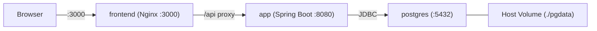

# Infrastructure

## 1. Overview

A aplicação corre como 3 containers Docker orquestrados por Docker Compose:

1. **postgres** -- Base de dados PostgreSQL com volume persistente
2. **app** -- Backend Spring Boot a servir a API REST
3. **frontend** -- Nginx a servir o React SPA e a fazer proxy da API



## 2. Docker Compose

```yaml
# docker-compose.yml (raiz do projecto)
services:
  postgres:
    image: postgres:16-alpine
    container_name: athlete-db
    environment:
      POSTGRES_DB: athletedb
      POSTGRES_USER: athlete
      POSTGRES_PASSWORD: athlete
    ports:
      - "5432:5432"
    volumes:
      - ./pgdata:/var/lib/postgresql/data
    healthcheck:
      test: ["CMD-SHELL", "pg_isready -U athlete -d athletedb"]
      interval: 5s
      timeout: 3s
      retries: 5

  app:
    build:
      context: ./backend
      dockerfile: Dockerfile
    container_name: athlete-app
    environment:
      DB_HOST: postgres
      DB_PORT: 5432
      DB_NAME: athletedb
      DB_USER: athlete
      DB_PASS: athlete
    ports:
      - "8080:8080"
    depends_on:
      postgres:
        condition: service_healthy

  frontend:
    build:
      context: ./frontend
      dockerfile: Dockerfile
    container_name: athlete-frontend
    ports:
      - "3000:80"
    depends_on:
      - app
```

### Persistência de Dados

O volume `./pgdata` mapeia o directório de dados do PostgreSQL para o host. Isto garante que:

- Os dados sobrevivem a restarts dos containers (`docker compose down` / `docker compose up`).
- Os dados sobrevivem a rebuilds das imagens.
- Os dados só se perdem se apagares explicitamente a pasta `./pgdata`.

Para reset completo da base de dados:

```bash
docker compose down
rm -rf ./pgdata
docker compose up -d --build
```

## 3. Backend Dockerfile

```dockerfile
# backend/Dockerfile
FROM maven:3.9-eclipse-temurin-21 AS build
WORKDIR /app
COPY pom.xml ./
RUN mvn dependency:go-offline -B
COPY src ./src
RUN mvn package -DskipTests -B

FROM eclipse-temurin:21-jre-alpine
WORKDIR /app
COPY --from=build /app/target/*.jar app.jar
EXPOSE 8080
ENTRYPOINT ["java", "-jar", "app.jar"]
```

Multi-stage build:
1. **Build stage**: Maven compila e empacota o fat JAR do Spring Boot.
2. **Runtime stage**: Imagem JRE mínima corre o JAR.

## 4. Frontend Dockerfile

```dockerfile
# frontend/Dockerfile
FROM node:20-alpine AS build
WORKDIR /app
COPY package.json package-lock.json ./
RUN npm ci
COPY . .
RUN npm run build

FROM nginx:alpine
COPY --from=build /app/dist /usr/share/nginx/html
COPY nginx.conf /etc/nginx/conf.d/default.conf
EXPOSE 80
```

### Configuração Nginx

```nginx
# frontend/nginx.conf
server {
    listen 80;
    server_name localhost;
    root /usr/share/nginx/html;
    index index.html;

    # API proxy para o backend
    location /api/ {
        proxy_pass http://app:8080/api/;
        proxy_set_header Host $host;
        proxy_set_header X-Real-IP $remote_addr;
    }

    # SPA fallback
    location / {
        try_files $uri $uri/ /index.html;
    }
}
```

Esta configuração:
- Faz proxy de todos os pedidos `/api/` para o backend Spring Boot.
- Serve o React SPA para todas as outras rotas (com HTML5 history fallback).

## 5. Variáveis de Ambiente

| Variável | Serviço | Default | Descrição |
|----------|---------|---------|-----------|
| `DB_HOST` | app | `localhost` | Host do PostgreSQL |
| `DB_PORT` | app | `5432` | Porta do PostgreSQL |
| `DB_NAME` | app | `athletedb` | Nome da base de dados |
| `DB_USER` | app | `athlete` | Username da base de dados |
| `DB_PASS` | app | `athlete` | Password da base de dados |
| `POSTGRES_DB` | postgres | - | Base de dados a criar no primeiro arranque |
| `POSTGRES_USER` | postgres | - | Nome do superuser |
| `POSTGRES_PASSWORD` | postgres | - | Password do superuser |

## 6. Comandos

```bash
# Arrancar tudo
docker compose up -d --build

# Ver logs
docker compose logs -f app
docker compose logs -f postgres
docker compose logs -f frontend

# Parar (dados preservados em ./pgdata)
docker compose down

# Parar e destruir dados
docker compose down
rm -rf ./pgdata
```

## 7. Estrutura Raiz

```
trainning-management-app/
├── README.md
├── docker-compose.yml
├── docs/
│   ├── PRD.md
│   ├── DATA_MODEL.md
│   ├── API_CONTRACT.md
│   ├── BACKEND_ARCHITECTURE.md
│   ├── FRONTEND_ARCHITECTURE.md
│   ├── INFRASTRUCTURE.md
│   └── EXERCISE_MODALITY.md
├── backend/
│   ├── Dockerfile
│   ├── pom.xml
│   └── src/
├── frontend/
│   ├── Dockerfile
│   ├── nginx.conf
│   ├── package.json
│   ├── vite.config.ts
│   └── src/
└── pgdata/                  (gitignored, criado pelo Docker)
```
