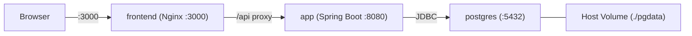

# Infrastructure

## 1. Overview

The application runs as two Docker containers orchestrated by Docker Compose:

1. **app** -- Spring Boot backend serving the REST API (and optionally the frontend static files)
2. **postgres** -- PostgreSQL database with a persistent volume

The frontend runs as a separate Vite dev server during development, and in production is built as static files served by an Nginx container or embedded into the Spring Boot jar.



## 2. Docker Compose

```yaml
# docker-compose.yml (place at project root)
version: "3.8"

services:
  postgres:
    image: postgres:16-alpine
    container_name: athlete-db
    environment:
      POSTGRES_DB: athletedb
      POSTGRES_USER: athlete
      POSTGRES_PASSWORD: athlete
    ports:
      - "5432:5432"
    volumes:
      - ./pgdata:/var/lib/postgresql/data
    healthcheck:
      test: ["CMD-SHELL", "pg_isready -U athlete -d athletedb"]
      interval: 5s
      timeout: 3s
      retries: 5

  app:
    build:
      context: ./backend
      dockerfile: Dockerfile
    container_name: athlete-app
    environment:
      SPRING_PROFILES_ACTIVE: docker
      DB_HOST: postgres
      DB_PORT: 5432
      DB_NAME: athletedb
      DB_USER: athlete
      DB_PASS: athlete
    ports:
      - "8080:8080"
    depends_on:
      postgres:
        condition: service_healthy

  frontend:
    build:
      context: ./frontend
      dockerfile: Dockerfile
    container_name: athlete-frontend
    ports:
      - "3000:80"
    depends_on:
      - app
```

### Data Persistence

The `./pgdata` volume mount maps the PostgreSQL data directory to a folder on the host filesystem. This ensures that:

- Data survives container restarts (`docker compose down` / `docker compose up`).
- Data survives image rebuilds.
- Data is only lost if you explicitly delete the `./pgdata` folder.

To reset the database completely:

```bash
docker compose down
rm -rf ./pgdata
docker compose up -d
```

## 3. Backend Dockerfile

```dockerfile
# backend/Dockerfile
FROM maven:3.9-eclipse-temurin-21 AS build
WORKDIR /app
COPY pom.xml ./
RUN mvn dependency:go-offline -B
COPY src ./src
RUN mvn package -DskipTests -B

FROM eclipse-temurin:21-jre-alpine
WORKDIR /app
COPY --from=build /app/target/*.jar app.jar
EXPOSE 8080
ENTRYPOINT ["java", "-jar", "app.jar"]
```

Multi-stage build:
1. **Build stage**: Uses Maven to compile and package the Spring Boot fat JAR.
2. **Runtime stage**: Minimal JRE image runs the JAR.

## 4. Frontend Dockerfile

```dockerfile
# frontend/Dockerfile
FROM node:20-alpine AS build
WORKDIR /app
COPY package.json package-lock.json ./
RUN npm ci
COPY . .
RUN npm run build

FROM nginx:alpine
COPY --from=build /app/dist /usr/share/nginx/html
COPY nginx.conf /etc/nginx/conf.d/default.conf
EXPOSE 80
```

### Nginx Configuration

```nginx
# frontend/nginx.conf
server {
    listen 80;
    server_name localhost;
    root /usr/share/nginx/html;
    index index.html;

    # API proxy to backend
    location /api/ {
        proxy_pass http://app:8080/api/;
        proxy_set_header Host $host;
        proxy_set_header X-Real-IP $remote_addr;
    }

    # SPA fallback
    location / {
        try_files $uri $uri/ /index.html;
    }
}
```

This configuration:
- Proxies all `/api/` requests to the Spring Boot backend.
- Serves the React SPA for all other routes (with HTML5 history fallback).

## 5. Local Development (Without Docker)

For local development, you can run the backend and frontend separately without Docker:

### Backend (H2 in-memory DB)

```bash
cd backend
mvn clean install
mvn spring-boot:run -Dspring-boot.run.profiles=local
```

Runs on `http://localhost:8080` with H2 in-memory database. The H2 console is available at `http://localhost:8080/h2-console`.

### Frontend (Vite dev server)

```bash
cd frontend
npm install
npm run dev
```

Runs on `http://localhost:5173` with hot module replacement. API calls proxy to `http://localhost:8080`.

### Vite Proxy (for local dev)

```typescript
// vite.config.ts
export default defineConfig({
  plugins: [react()],
  server: {
    port: 5173,
    proxy: {
      "/api": {
        target: "http://localhost:8080",
        changeOrigin: true,
      },
    },
  },
});
```

## 6. Environment Variables

| Variable | Service | Default | Description |
|----------|---------|---------|-------------|
| `SPRING_PROFILES_ACTIVE` | app | `local` | Spring profile (`local` or `docker`) |
| `DB_HOST` | app | `localhost` | PostgreSQL host |
| `DB_PORT` | app | `5432` | PostgreSQL port |
| `DB_NAME` | app | `athletedb` | Database name |
| `DB_USER` | app | `athlete` | Database username |
| `DB_PASS` | app | `athlete` | Database password |
| `POSTGRES_DB` | postgres | - | Database to create on first run |
| `POSTGRES_USER` | postgres | - | Superuser name |
| `POSTGRES_PASSWORD` | postgres | - | Superuser password |
| `VITE_API_URL` | frontend | `http://localhost:8080/api` | API base URL (only for dev; in prod, Nginx proxies) |

## 7. Common Commands

```bash
# Start everything
docker compose up -d

# Rebuild after code changes
docker compose up -d --build

# View logs
docker compose logs -f app
docker compose logs -f postgres

# Stop (data persists in ./pgdata)
docker compose down

# Stop and destroy data
docker compose down
rm -rf ./pgdata

# Build and test backend
cd backend && mvn clean install

# Run frontend in dev mode
cd frontend && npm run dev
```

## 8. Project Root Structure

```
trainning-management-app/
├── README.md
├── docker-compose.yml
├── docs/
│   ├── PRD.md
│   ├── DATA_MODEL.md
│   ├── API_CONTRACT.md
│   ├── BACKEND_ARCHITECTURE.md
│   ├── FRONTEND_ARCHITECTURE.md
│   └── INFRASTRUCTURE.md
├── backend/
│   ├── Dockerfile
│   ├── pom.xml
│   └── src/
│       └── ...
├── frontend/
│   ├── Dockerfile
│   ├── nginx.conf
│   ├── package.json
│   ├── vite.config.ts
│   └── src/
│       └── ...
└── pgdata/                  (gitignored, created by Docker)
```

Add `pgdata/` to `.gitignore` to avoid committing database files.
